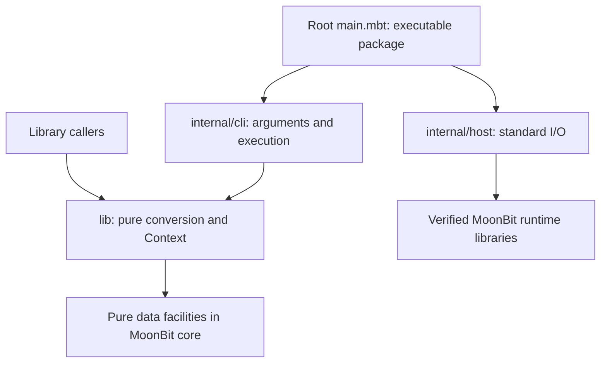

# 02 Overall Architecture and Project Structure

Status: Architecture baseline; implementation status is tracked in [docs/README.md](README.md). Related documents: [semantic contract](03-path-semantics.md), [API and delivery](04-api-and-cli.md), and [validation roadmap](05-validation-and-roadmap.md).

## 1. Goals and Boundaries

There are two deliverables: a path-conversion library that other MoonBit packages can import, and a command-line package executable through `moonx`. Both share one pure MoonBit implementation. Their primary purpose is to convert path representations in scripts, build tools, and cross-platform tasks, not to access the files identified by the results.

Given the same input, context, and options, the core library must return the same result regardless of compilation backend, host operating system, environment variables, or working directory. The CLI translates external input into this explicit contract; the core must never detect host context for itself.

Non-goals include reproducing the entire Cygwin DLL, implementing a filesystem or symlink resolver, automatically converting arbitrary shell-command arguments, replacing WSL's `wslpath`, and implementing Cygwin private-use-area encoding for invalid Windows filenames. The project may recognize related inputs and options and report them as unsupported, but must not guess an apparently valid path.

## 2. Pure MoonBit and the Runtime Boundary

Do not introduce `.c`, `.cc`, `.h`, `native-stub`, or project-defined `extern` declarations, or execute system `cygpath`, PowerShell, cmd, or a shell to implement product behavior. Test tooling may run official programs to collect reference results; the product execution path may not.

Standard arguments, standard streams, and file reads as needed use MoonBit runtime libraries, with adaptation concentrated in `internal/host`. This does not mean that host capabilities are absent: the runtime necessarily provides I/O. The project nevertheless maintains one path algorithm for Wasm and Native and does not bypass the standard runtime with backend-specific implementations.

Wasm is the default delivery target. Native is a same-source consistency target and an optional build artifact. Root and `internal/host` explicitly support Wasm and Native because their current I/O runtime supports these delivery targets. `lib/` and `internal/cli` remain pure and compile on all standard compiler targets. Pure MoonBit alone does not prove identical behavior: encoding, standard-stream line endings, exit codes, and runtime arguments still require verification. Checks for the `wasm-gc` and `js` pure packages are recorded separately from Wasm/Native CLI delivery.

## 3. Target Structure by Responsibility

The P1 library and P2 executable packages now follow the structure below. Validation and collection tooling has its own evidence requirements; [docs/README.md](README.md) tracks execution status. The root-level `main.mbt` is the direct entry point required by the user. The root package is configured as the executable for future publication, and the public library lives in `lib/`.

```text
cygpath/
├── moon.mod                       Module, version, dependencies, default wasm
├── moon.pkg                       Root executable: pkgtype(kind: "executable")
├── main.mbt                       Read input → dispatch → write output → exit
├── README.md                      Module documentation, not executable doctests
├── lib/                           Public library ZSeanYves/cygpath/lib
│   ├── moon.pkg                   Default library package
│   ├── types.mbt                  Public types such as InputSyntax and OutputFormat
│   ├── context.mbt                Context / Mount validation and read-only state
│   ├── error.mbt                  Structured ConversionError
│   ├── convert.mbt                Single-path conversion orchestration
│   ├── parse.mbt                  Private path classification and scanning
│   ├── normalize.mbt              Constrained lexical normalization
│   ├── mount.mbt                  Mount matching and drive mapping
│   ├── render.mbt                 Windows / Mixed / POSIX output
│   ├── path_list.mbt              Explicitly directional list rules
│   ├── *_test.mbt                 Public behavior, properties, and regressions
│   ├── *_wbtest.mbt               Parser-internal tests where necessary
│   └── pkg.generated.mbti         Generated public library interface
├── internal/
│   ├── cli/
│   │   ├── moon.pkg
│   │   ├── parse.mbt              argv → Command, option validation
│   │   ├── types.mbt              Request / Converter and explicit context
│   │   ├── error.mbt              Stable error categories and diagnostics
│   │   ├── help.mbt               Help and implementation version
│   │   └── *_test.mbt
│   └── host/
│       ├── moon.pkg
│       ├── input.mbt              argv, UTF-8 files / standard input
│       ├── output.mbt             Byte output, standard error, exit
│       ├── error.mbt              Stable host error categories
│       └── input_wbtest.mbt       Decoding and streaming boundary tests
├── testdata/
│   ├── contracts/                 Independently specified pure-conversion contracts
│   └── oracle/                    Official-tool observations and environment metadata
├── scripts/                       .mbtx validation / collection programs
│   ├── check_cli.mbtx             Portable contracts and backend comparison
│   └── oracle.mbtx                Windows official collection and replay
├── .github/workflows/check.yml    Linux / macOS / Windows acceptance jobs
└── docs/                          This architecture book
```

MoonBit package boundaries follow directories, not files. Parsing, conversion, and public types initially share the `lib/` package; private visibility isolates implementation details. File organization alone does not justify additional `parser`, `engine`, or `model` packages. Extract packages only when real independent reuse or a build boundary calls for them. The repository root holds only the thin CLI entry point and project-level configuration.

All public concrete types that users should be able to name, construct, or match belong to `lib/`. They must not be hidden in `internal/*` and then re-exported. The `Command`, diagnostics, and per-item execution results in `internal/cli` are module-internal and must not leak into the library API. Library callers import `ZSeanYves/cygpath/lib`. CLI users pass options and paths through `moonx ZSeanYves/cygpath`, for example `moonx ZSeanYves/cygpath -h`.

## 4. Dependency Direction



- `lib/` does not import `env`, filesystem, process, network, CLI, or `internal/host` facilities.
- `internal/cli` does not read or write files or exit the process directly; it receives data from its caller.
- `internal/host` does not interpret drives, mounts, or cygdrive, and does not depend on CLI or core business types.
- Root `main.mbt` joins I/O and application behavior: it passes host data to the CLI and passes results to the host. Neither `lib/` nor `internal/*` depends on the root executable package.
- The historical architecture baseline had no external dependencies. P2 pins `moonbitlang/async@0.22.4` for general-purpose file and standard-stream I/O and `moonbitlang/x@0.5.5` for process exit. Both dependencies declare Apache-2.0 licenses. Root uses the async runtime; `internal/host` owns runtime calls. The library and CLI parser still import no host packages.

The runtime dependencies contain their own backend implementation details; this
is the standard runtime boundary permitted by the pure MoonBit agreement. No
project C/C++ stubs, foreign imports, or system-command conversion fallback are
introduced. Test scripts additionally use the official process API and SHA-256
facilities; product conversion does not launch subprocesses. Pinning versions
does not replace the host/backend evidence recorded in the index.

Filenames and a few private types may change during implementation. Dependency direction, ownership of public types, and the pure MoonBit boundary remain ongoing constraints.

## 5. Data Flow and State Ownership

A call proceeds as follows:

1. The host reads argv. The CLI first handles help, version, and syntax errors, without opening a `-f` file prematurely.
2. The CLI produces a `Command` that explicitly determines output format, input direction, list mode, and context options.
3. For `Convert(request)`, main calls `request.prepare()` to construct one validated Context before reading input or writing results. Help and version skip context construction. There is no automatic scanning of fstab, the registry, or installation directories.
4. The core converts each input through classification, validation, relative-path resolution when requested, mount mapping, and rendering.
5. The pure CLI returns each result or structured error. Main writes successful records in the prescribed order or stops processing; it formats CLI and host diagnostics through their owning packages.
6. The host encodes UTF-8, writes the exact bytes supplied by main, handles I/O errors, and returns the exit code. Main appends the required LF explicitly.

Context holds the profile, cygdrive prefix, mount collection, and optional cwd information. It is immutable after construction and copies mutable containers supplied by the caller, preventing later caller mutations from changing an existing converter. Calls are independent, with no global environment cache; a new context represents a new environment snapshot.

A failed single-path library conversion never returns a partial string. List conversion first produces all member results; if any member fails, the entire list fails. The CLI processes multiple NAME arguments in order. Successful records already written are not retracted; processing stops at the first failure, which produces no stdout record. `-f` reads and processes lines incrementally instead of loading the entire file.

## 6. Minimum Context Requirements

Converting `C:\work` to `/cygdrive/c/work` needs only the profile and prefix. Converting `/usr/bin` to a Windows path needs a root or specific mount. Absolutizing `C:work` needs the cwd for drive C. Resolving `\work` needs the current drive, or a Windows cwd that determines that drive. Missing data produces `MissingContext`; a macOS/Linux host cwd must never stand in for a Windows cwd.

Library callers supply context directly; the CLI exposes explicit extension options. The first version does not need a persistent configuration file or environment-variable precedence system. `--root` creates the root mount. Other mounts use the repeatable two-argument form `--mount POSIX WINDOWS`, avoiding a `:` delimiter that would conflict with drive letters. Add more complex fstab parsing only when a real need and corresponding tests justify it.

## 7. Algorithms and Resource Policy

Classify and render a single path with linear scans, preserving other Unicode content while scanning ASCII structural markers. The initial mount implementation uses presorted arrays and matches complete component boundaries. Construction costs approximately `O(m log m)` and lookup is bounded by `O(m × n)`, where m is the number of mounts and n is input length. Do not introduce tries, shared caches, or parallel pipelines without measurements that justify them.

Do not hard-code `MAX_PATH = 260`: lexical conversion differs from actual Windows file access, and extended namespaces have separate boundaries. Scan lists member by member; total work depends on the combined character count and mount matching. The CLI streams files but still requires a complete string for each path. Resource limits for enormous individual lines belong to later I/O acceptance testing; integer overflow or panics are not an acceptable policy.

The standard async runtime serves file and stream I/O. Records are processed
sequentially; this does not introduce concurrent conversion tasks. Do not add
parallel tasks, threads, resident services, plugin registries, or persistent state
without a product requirement.

## 8. Initial Implementation Slices

The implemented P1 slice provides the path engine, mounts, cwd, lists, and error
types in `lib/`. P2 adds pure argument parsing, root `main.mbt`, executable
configuration, and the host boundary. Continue to require identical stdout,
stderr, and exit status for the portable contract on Wasm and Native; existence
of the packages does not close the cross-host acceptance matrix. Extend behavior
according to [03](03-path-semantics.md) with corresponding evidence.

A functional phase is complete only when source, tests, generated interfaces, and documentation together establish a runnable and verified implementation. The initial baseline contained only documentation and module metadata. Its empty-package check results cannot establish that a newly implemented executable or public library has been verified; record current results in [docs/README.md](README.md).
