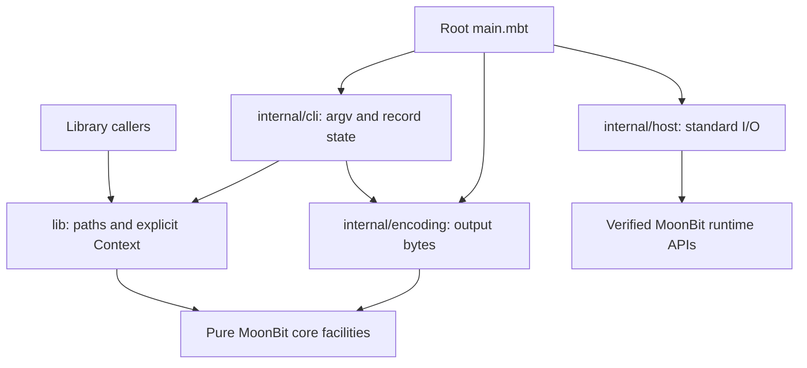

# 02 Overall Architecture and Project Structure

Status: implemented architecture, with the frozen P3 matrix verified at `b32dd7448658bc251b216ba93a5c120ef54fdbc9`. [The index](README.md) and [remote validation](09-remote-validation.md) record host/backend results. Related contracts: [path semantics](03-path-semantics.md), [API and CLI](04-api-and-cli.md), and [validation roadmap](05-validation-and-roadmap.md).

## 1. Goals and Boundaries

The project provides a reusable path-conversion library and a command-line package invoked through `moonx`. Both use pure MoonBit. Given identical input, explicit context, and options, conversion must have identical semantics across Wasm and Native, independent of the machine's environment or cwd.

The library converts representations and applies the selected Cygwin/MSYS2 rules. It does not establish that a converted name exists or identifies the same filesystem entity after symlink, junction, device, or short-name resolution. Implemented private-use-area filename mapping and extended-drive/UNC formatting are lexical operations; they do not introduce a filesystem resolver.

P3 completion means the declared portable matrix has exact evidence for its supported domain and separate evidence for its rejection boundaries. It does not mean full official compatibility or an unlimited maximum implementation. Missing host APIs and feasible but unimplemented pure algorithms are separate categories in [chapter 01](01-upstream-and-scope.md).

## 2. Pure MoonBit and the Runtime Boundary

Product code must not introduce C/C++ stubs, project-defined foreign imports, native Windows business-logic bindings, or a subprocess fallback to official cygpath, PowerShell, cmd, or a shell. General-purpose I/O from the official MoonBit runtime is allowed and concentrated in `internal/host`.

Validation tooling may launch official programs and independent diagnostic probes. In particular, the Windows code-page probe uses PowerShell/.NET interop only to observe Win32 behavior and retains its raw evidence. That code is not imported or called by the product. No upstream C implementation is compiled or linked into the product.

Wasm is the default delivery target. Native is a same-source consistency target and an optional development artifact. Root and `internal/host` declare Wasm/Native support because their I/O runtime supports those targets. The library, CLI, and encoder are pure packages checked on all standard targets; that does not imply JavaScript or Wasm GC command-line I/O support. Raw bytes, exit status, argv, and file behavior still require real backend/host verification.

## 3. Structure by Responsibility

The root-level `main.mbt` is the direct entry point. Root `moon.pkg` declares `pkgtype(kind: "executable")`; `lib/` is the public library. New packages are added for implemented responsibilities, not speculative layers.

```text
cygpath/
├── moon.mod                         Module metadata and pinned dependencies
├── moon.pkg                         Root executable, default Wasm
├── main.mbt                         Read → dispatch → encode/write → exit
├── README.md                        Module guide
├── lib/                             Public ZSeanYves/cygpath/lib
│   ├── types.mbt, error.mbt          Public types and checked errors
│   ├── context.mbt                  Immutable validated Context
│   ├── parse.mbt, normalize.mbt     Grammar and lexical resolution
│   ├── mount.mbt, msys_mount.mbt     Profile-specific mount ordering/mapping
│   ├── filename_encoding.mbt        Filename private-use-area mapping
│   ├── convert.mbt, render.mbt      Conversion and output spelling
│   ├── path_list.mbt                Directional lists
│   ├── README.mbt.md, *_test.mbt    Executable examples and tests
│   └── pkg.generated.mbti           Public interface
├── internal/
│   ├── cli/                         Pure argv, requests, record state, diagnostics
│   ├── encoding/                    Pure numeric-codepage tables and encoder
│   └── host/                        Runtime argv, input, byte streams, exit
├── testdata/
│   ├── contracts/                   Independent portable process contracts
│   └── oracle/                      Immutable inputs and frozen P3 scope
├── scripts/                         .mbtx automation only
│   ├── check_cli.mbtx               Portable processes/backend comparison
│   ├── check_consumer.mbtx          External public-library consumer
│   ├── oracle.mbtx                  Official collection/replay/fault drills
│   ├── ci_oracle.mbtx               Measured Windows contexts and strict gate
│   ├── probe_windows_codepages.mbtx Independent Windows API diagnosis
│   └── generate_codepages.mbtx      Verified data → pure mapping tables
├── third_party/
│   ├── unicode/                    Unicode-hosted mapping data and notice
│   ├── microsoft/                  Microsoft archive data and permission
│   └── newlib/                     BSD sorting adaptation attribution
├── .github/workflows/              Three-host checks and Windows oracle jobs
└── docs/                            Architecture, contracts, and evidence
```

MoonBit package boundaries follow directories, not files. Parsing, conversion, and public types share `lib/`; private visibility separates their implementation details. Each package contains its `moon.pkg` and generated interface. Only public domain types that library callers should name, construct, or match belong to `lib/`. Internal `Command`, `Request`, `Converter`, and host errors must not leak into its API.

Library callers import `ZSeanYves/cygpath/lib`. After owner publication, command users invoke `moonx ZSeanYves/cygpath -h` or another ordinary option directly. Root remains a thin composition layer and contains no path-conversion algorithm.

## 4. Dependency Direction



- `lib/` imports no environment, filesystem, process, CLI, or host facilities.
- `internal/cli` parses already-tokenized argv, validates supported code pages, and operates on explicit values. It performs no I/O.
- `internal/encoding` maps text to bytes without consulting the locale, filesystem, or operating-system codec.
- `internal/host` performs argv, file/stream, and exit operations. It does not interpret drives, mounts, or cygdrive and does not depend on CLI or library business types.
- Root composes those packages. No lower package depends on the executable root.

`moonbitlang/async@0.22.4` supplies the async runtime and general file/stream facilities; `moonbitlang/x@0.5.5` supplies process exit. Both declare Apache-2.0. Test scripts additionally use process APIs and SHA-256. Their backend internals are runtime implementation details, not project-owned conversion FFI. Product conversion launches no subprocesses.

The 111 archived table identities retain separate Unicode/Microsoft notices; 110 legacy numeric pages are enabled plus UTF-8. The MSYS2 sorting helpers adapt BSD-3-Clause newlib code with its full notice retained. These permissions do not relicense GPL/LGPL Cygwin runtime implementation. See [provenance](01-upstream-and-scope.md#3-licensing-and-implementation-provenance).

## 5. Data Flow and State Ownership

1. Host supplies argv without the executable name. CLI parsing applies option order and recognition rules and returns `Help`, `Version`, `ExitSuccess`, or `Convert(Request)`.
2. For a conversion, `Request::prepare` builds one validated immutable Context before reading a file or producing path results. Control commands skip that construction.
3. NAME operands are processed in order. File/stdin input is streamed through the host text-record adapter; `-o` records go through the converter's state machine.
4. The core classifies, resolves, maps, and renders each path/list using explicit syntax, options, and the selected profile.
5. The CLI returns `Output(text)`, `Skip`, or `Stop(text)`. Root encodes conversion text using `Converter::codepage()`, then appends one raw LF byte and writes it. POSIX output always selects UTF-8; Windows/Mixed output uses the explicit supported encoder. Help/version and diagnostics use UTF-8.
6. Host writes the exact supplied bytes and reports I/O errors. Root stops on a failure or successful control stop, formats the owning package's diagnostic, and exits with its assigned status.

Context stores the profile, drive prefix, ordered mount snapshots, and optional POSIX/Windows cwd. It copies caller-owned collections and never reads global host state. `drive_cwds` values are validated compatibility metadata; they are not stored as resolution state and do not override cygpath's drive-root behavior.

Converter owns mutable per-file option state separately from Context. With `-o`, a record beginning with a hyphen is divided at its first whitespace into an option token and the remaining argument. Parsing such a record resets conversion flags while retaining the prepared Context; following plain records reuse the new flags. There is no shell quoting or arbitrary argv tokenization. A help/version/control stop prevents later records from being decoded or executed.

Input follows the measured text-mode file loop: CRLF translation, retained BOM content, final unterminated records, C-string NUL interpretation, and chunks bounded by the official 8192-byte record buffer. Invalid UTF-8 is rejected deterministically before conversion; undefined upstream memory contents are not simulated. An empty stream succeeds with no output. Chapter 04 defines the exact empty-record, `-i`, and diagnostic behavior.

A single library call returns a complete result or an error. A list is atomic within its call. A batch/file can already have emitted earlier successful records when a later record fails; those bytes remain. A write failure stops processing and must not cause a batch retry that duplicates output.

## 6. Explicit Context and Profile Semantics

An unmatched Windows drive path needs only the selected profile and prefix to become a POSIX drive path. A POSIX-rooted input outside that prefix needs a matching root or mount for Windows output. Ordinary relative paths and current-drive-rooted paths use the relevant explicitly supplied cwd when resolution requires it. Missing necessary context reports `MissingContext`; the build host's cwd is never substituted.

`--root` declares the root mount; repeatable `--mount POSIX WINDOWS` uses two values to avoid drive-colon ambiguity. `--mount-case` selects sensitive or ASCII-insensitive matching for an explicit mount. Context construction rejects invalid/duplicate mappings and drive-prefix collisions. Per-drive cwd metadata is validated without changing the drive-root conversion rule.

Cygwin and MSYS2 are separate semantic profiles, including mount ordering and mapped-root trailing separators as well as default drive prefixes. The MSYS2 implementation preserves the sorting behavior required by the measured explicit contexts; a generic stable longest-prefix sort is not equivalent. Context does not represent arbitrary runtime user/system provenance or recover hidden insertion history. New environment combinations require their own evidence.

No product parser reads fstab, registry entries, `HOME`, or `MSYSTEM` to guess context. The independent Windows harness measures the installed environment and transcribes a documented equivalent Context; this separation makes the same request reproducible across backends.

## 7. Algorithms and Resource Policy

Path scanning and rendering follow input/output size, with ASCII markers separating structural parsing from Unicode content. Filename escaping and legacy encoding are pure transformations. Generated encoding tables use sorted UTF-16/encoded-value pairs and binary search; source/member/packed hashes bind regeneration to its data.

Mount lookup scans profile-ordered arrays and compares component prefixes. With m mounts and input length n, lookup is bounded by `O(m × n)`; report construction and profile-specific sorting costs separately. MSYS2's observable sorting algorithm must not be replaced solely on an assumed complexity improvement. No performance claim follows from compatibility tests.

There is no blanket 260-character rejection. The measured Windows-output rules include 255-UTF-16-unit component checks, automatic long-path prefixes, and relative-path resolution where needed. These formatting checks are not assertions about filesystem access. File input uses fixed record chunks and sequential callbacks rather than retaining the entire stream. The core API still accepts caller-provided strings and allocates complete results; panics or integer overflow are not a resource policy.

Do not add tries, caches, parallel conversion, resident services, or plugin systems without a measured need. The async runtime serves sequential I/O; it does not change path semantics or introduce concurrent record execution.

## 8. Acceptance and Further Changes

The implemented P1/P2 architecture is exercised by portable contracts and real processes on Linux, macOS, and Windows. The completed P3 gate covers the frozen explicit-context matrix with separate Cygwin/MSYS2 default/custom environments, both backends, collection/replay, coverage audits, and real Windows fault drills. Supported-domain comparisons must be exact. Malformed UTF-8 and unavailable CP29001 retain raw observations but pass only their separate deterministic rejection contracts.

Source, tests, generated interfaces, documentation, and evidence must describe the same behavior. Historical discovery approvals do not waive new supported-domain differences. Feasible unimplemented algorithms such as stateful encodings or GB18030 remain extensions outside this freeze; 8.3 and system-directory queries additionally need unavailable equivalent host facilities. Neither category authorizes product FFI or command fallbacks.

Release is separate: the repository owner chooses and publishes the version. Preserve root `main.mbt`, all required third-party notices, and the root command coordinate. Exact-version `moonx` retrieval and execution remain post-publication acceptance, not a consequence of green repository CI.
